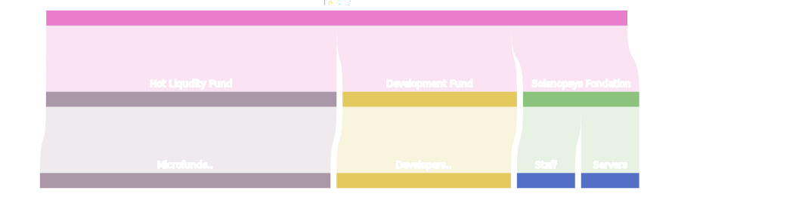

content/topics/solenopsys/01.ecosystem.md
# Solenopsys - decentralized silicon valery

The name "solenopsys" is derived from the ants of the Solenopsis genus, where the 'i' is replaced with 'y' from the
word "systems." Solenopsis ants encompass numerous species, are found worldwide, and are known for their high
adaptability and rapid colony development.

In analogy to ants, each member of our community is like an ant, and the technological startups within the community are
different ant species. All these developers are located in various parts of the planet and collaborate to implement new
technologies.

content/topics/solenopsys/ecosystem/01.problem.md
# The problem

Currently, numerous innovations are being produced in Silicon Valley. It has the capital, the best developers, and the
infrastructure for rapidly launching technological startups. The problem is that Silicon Valley is the only place on the
planet where the venture infrastructure actually works. Anyone who wants to launch startups must come to Silicon Valley,
not everyone has the opportunity to do so.

The population of the USA constitutes approximately 4% of the total world population. 96% of the world's population does
not have the opportunity to bring their ideas to life simply because they do not live in the USA. Such centralization in
one point of the planet is not very effective in the modern world. Excellent engineers and developers live all around
the world. The cryptocurrency market, with a trillion-dollar capitalization, is capable of financing any technological
companies.

content/topics/solenopsys/ecosystem/02.mission.md
# The mission

To provide equal access to venture capital and technological infrastructure for rapid creation and global market entry
of high-tech products to anyone or organization anywhere on the planet.

content/topics/solenopsys/ecosystem/03.marketplace.md
# Marketplace

On our marketplace, you can purchase products created by community members as well as a variety of services.

Here, you will be able to interact with product creators and freelance engineers.

The difference between our marketplace and others, like Alibaba or Amazon, is that we provide not only full product
documentation and source files but also engineering files and software such as drivers and configuration files. This
means that you can instantly integrate the device into your existing robotic system, receive technical support, or
engage with product creators.

content/topics/solenopsys/02.community.md
# Community

The Solenopsys community consists of:

- **Creators:** Сreate new ideas, technologies, and approaches, design and develop technical solutions. They include inventors, scientists, developers, engineers, and designers.
- **Investors:** Investors evaluate projects and provide financial resources to other community members.
- **Entrepreneurs:** Entrepreneurs use investors' funds to create businesses based on ideas and technologies from Creators and Innovators.

content/topics/solenopsys/04.matrix..md
# Matrix - Industrial Design System

This is the world's first open industrial design system. In simple terms, it's a set of rules for developers creating
new products within the Solenopsys ecosystem. The idea is inspired by design systems created by major corporations for
their platforms, such as Microsoft, Google, and Apple.

The main distinction of Matrix from other existing design systems is that compatibility requirements are described using
code, allowing for easy control of their execution and the automation of processes.

**The main goal of this design system** is to ensure compatibility among developments from thousands of companies,
enabling them to work as a unified whole. This compatibility spans different levels, from the physical execution of
industrial designs to virtual interfaces and data exchange protocols.

**What sets it apart from other existing design systems** is that, while design systems from major corporations are
mainly focused on software, the Matrix design system covers various aspects of design and development, including design
rules for physical devices.

# The design system consists of

- **Guidelines** - recommendations on how to do things right and well.
- **Standards** - mandatory rules and specifications in a particular field.
- **Protocols** - agreements on how devices or components interact and exchange data.

The system is flexible, open, and scalable. There can be many standards and specifications, each with its own name and
standard description. Standards and specifications will evolve with the introduction of new versions and the addition of
new elements. Since the platform is open, new standards will be added as needed.

## Examples of standards

### Virtual

- Visual interface
- Data exchange protocols (wireless, ...)
- Module interaction interfaces
- Component rules

### Physical

- Connector interfaces
- Physical connectors
- Data exchange protocols between devices
- Module sizes
- Industrial design guidelines

content/topics/solenopsys/06.technologies.md
# Technologies

- Converged - Decentralized UI framework
- ShockWaves - Decentralized Data processing framework
- Combinatorics - Hardware framework

content/topics/technologies/shockwaves/01.targets.md
## Purpose of ShockWaves

The future of engineering development lies in the synthesis of design through AI or high-performance computing.

The goal of ShockWaves is to provide community members with computational power that is currently only available to
large corporations.

Computations span diverse tasks. Machine learning includes PCB tracing, CNC handles 3D printing, and software deals with
program configurations. Generative design optimizes 3D printing. Physical process simulation models electromagnetics,
materials, and mechanics. Electronics simulation covers circuit operations. Data analysis processes sensor and log data
for insights. These tasks collectively define the broad spectrum of computational applications.

content/topics/technologies/shockwaves/02.advantages.md
# Advantages

### Advantages of MicroKernel Architecture

- **Easy Scalability** - Microkernels can be deployed flexibly, adapting to changing load demands.
- **Resource Limitation** - Each microkernel can be restricted in terms of resource usage.
- **Resource Usage Monitoring** - Allows tracking of computational resources expended during task processing.
- **Language Independence** - Different parts of the program can be written in various programming languages.
- **Code Reusability** - Microkernels can be reused across different applications, enhancing efficiency.

### Advantages of ShockWaves for Digital Manufacturing
- High fault tolerance due to operating in cluster mode.
- Automatic configuration and firmware updates for thousands of hardware devices.
- Automatic processing and scheduling of tasks, such as 3D printing tasks.
- Management of multiple devices as one entity, whether it's a single 3D printer or a hundred.
- Centralized log storage and notification of staff about failures.
- The ability to continue working in the event of individual node failures.

content/topics/technologies/shockwaves/02.clusterizing.md
# Clustering

In developing ShockWaves, our focus has been on scalability and compatibility. The ShockWaves platform always operates
in a Kubernetes cluster, even if it's running on a single computer.

## Scalability

ShockWaves is scalable and can be deployed on a range of devices, from a basic computer like a Raspberry Pi to a cluster
of hundreds of servers, or on an HPC (High-Performance Computing) cluster in the cloud.

## Compatibility

ShockWaves can be deployed on:

- Any Kubernetes cluster (k3s, k8s, etc.).
- Any cloud-based Kubernetes service (AWS, GCP, Azure, etc.).
- Any cloud-based HPC cluster managed by Kubernetes (k3s, k8s, etc.).
- Supports processor architectures including AMD64 and ARM64.

content/topics/technologies/shockwaves/03.architect.md
## MicroKernel Applications

A ShockWaves application is composed of multiple separate applications (micro-kernels) that, during assembly, are
packaged into Linux containers. The deployment of these cellular applications can occur in a single cluster or across a
multi-cluster decentralized environment.

Cellular applications are either built from existing open-source programs or developed from scratch. These programs are
segmented, modified for data exchange via queues, and then encapsulated into containers (micro-kernels). From these
containers, deployment configurations for cellular applications in Kubernetes clusters are created. This modular
approach allows for flexibility and scalability in deployment.

## Micro-Kernels

A micro-kernel is a part of a program that contains one or several resource-intensive data processing functions. If the
kernel includes multiple functions, they are logically unified by a single concept. This segment of the program is
packaged into a container and can be deployed in a Kubernetes cluster.

The functions within these micro-kernels are stateless between calls. Once a computational task is completed, all
resources are freed. When a function is invoked, all the resources of the container are dedicated solely to that task.
This design ensures efficient use of resources and optimal performance for each task.

## Framework Components

**Microservices** - Modules designed to handle user requests on the backend. They operate as containers within a
lightweight Kubernetes cluster. Users on the Solenopsys platform can create and publish their own microservices, which
are then immediately available for use by other network participants.

**Data Storage Services** - Converged uses data storage services instead of traditional databases with regular drivers.
These services act as wrappers for database drivers, enabling asynchronous interaction with the database via a message
queue.

**Cache** - A distributed cache that operates at the cluster level, storing the states of data processing workflows.

**FlowControl** - A micro-program that manages data and command streams.

**StreamGates** - Programs designed to receive data streams at the cluster's entry point, transform them,
and distribute the processed streams to HostRouters. eBPF technology can be employed for high-performance packet
conversion within StreamGates.

**ClusterRouter** - A program responsible for the deployment and scaling of cellular applications across clusters.

**HostRouter** - Manages the computational process of tasks. They enable interaction between multiple micro frontends
and microservices, directing message flows via WebSockets, crucial for real-time event display.

**Microkernels** - Specialized containers for data processing, akin to AWS lambda functions. ZeroMQ technology is used
for data exchange between microkernels. Within a single node (computer), data exchange can reach speeds of three million
messages per second with a transfer delay of approximately 5 microseconds.

**SHOCK Protocol** - Frontend and backend data exchange is conducted through message streams. This involves using
WebSockets for the frontend and ZeroMQ within the cluster.

content/topics/technologies/01.converged.md
# Converged - UI Framework

Converged is a UI (User Interface) framework designed to create decentralized web applications, similar to how Android
works for web platforms. It's tailored specifically for technology startups, providing a seamless interface that can be
used across both industrial systems and business applications. 

*The name "Converged" reflects its ability to handle
various tasks common in high-tech businesses, symbolizing the merging of different functions and solutions.*

The framework features a modular architecture, making it flexible and easy to expand or modify. This means that anyone
connected to the network can create and publish their own web module or web application. Furthermore, these creations
are
immediately accessible for use by any other network participant. Converged can support a vast array of visual interface
modules, each with unique functionality.

The Converged metaframework is inspired by Vite.js and based on Angular and Bun.

content/topics/technologies/02.shockwaves.md
# ShockWaves Framework

ShockWaves is a framework for distributed computing in a decentralized environment, built upon computational
microkernels, high-performance queues, and task routing using Directed Acyclic Graphs (DAGs).

At its core, ShockWaves utilizes a proprietary implementation of DAGs for data stream processing. The ShockWaves
framework is capable of processing millions of tasks per second and handling data streams at hundreds of gigabits per
second in real-time.

Designed to operate without bottlenecks, ShockWaves encompasses thousands of data processing modules. These modules are
capable of functioning on a single computer or across clusters of thousands of servers.

## Types of Accelerators

MicroKernels can interact with various types of accelerators, provided the necessary drivers are available. Here are some examples:

- **CPU** - Standard Processor
- **GPU** - Graphics Processing Unit
- **FPGA** - Field-Programmable Gate Array
- **NPU** - Neural Processing Unit
- **DSP** - Digital Signal Processor
- **ASIC** - Application-Specific Integrated Circuit

content/topics/technologies/03.combinatorics.md
# Combinatorics  Framework

Combinatorics is an industrial framework composed of individual electronic modules (power modules, motor control modules,
sensors, etc.). Like building with Lego blocks, these modules can be assembled to create diverse projects across various
industrial sectors, embodying the essence of convergence.

**Combinatorics** is an industrial framework consisting of various types of elements:

- Basic electronic modules with a standard interface
- FPGA-based hubs that bring the modules together into a unified system
- Standard connectors
- Standard motors
- Sensors

With these elements, you can create various robotic systems, much like assembling Lego blocks, from completely different
industrial sectors. The more basic modules you have, the more equipment variations you can create.

content/topics/technologies/converged/03.architect.md

## Architecture

Conveged это метафремворк на базе Angular,

Он отличается от базового тем что
- собственная система сборки.
- собственная система загрузки модулей.
- бинарный протокол обмена данными.

**Micro Frontends** - These are interface modules that can be added and extended dynamically. Any user can create and
publish their own micro frontend on the Solenopsys platform, and other network participants can immediately use it.

content/topics/technologies/combinatorics/01.conception.md
# Conception 

A modern industrial equipment control system should not resemble an electric control panel with a tangle of wires. It
should appear more like a server rack containing state-of-the-art equipment. Inside such a panel, there should be a
combination of high electrical power hardware and high-performance data processing systems.

The reason for the abundance of wires within control panels with machine controllers is the use of outdated standards
and data transmission protocols.

The Combinatorics framework introduces a new standard for expansion boards based on the M.2
interface, allowing the elimination of numerous wires and equipping equipment with high-speed data communication lines.

#### M2E Hub

The M2E Hub module is a board that contains multiple M2E connectors along one or more edges (using M.2 connectors
labeled B). The board contains an FPGA for integrating signals from connected modules. Each M2E connector is connected
to a separate FPGA port, allowing data transmission voltages ranging from 0.6V to 3.3V. Hub boards can be generated
using the Combinatorics platform service.

#### M2E Modules

M2E modules can include multiple connectors for connecting computational cores based on FPGA SOSC or ARM, which require
more data exchange lines. Data processing cores connect to these connectors, and multiple data exchange interfaces can
be attached to the same connectors. The data transmission interface of M2E modules includes 8 differential pairs and 8
regular data transmission lines.

##### Inverted Module Connectors

Unlike standard M.2 connectors, module boards use female connectors (Mama). This is done for two reasons: modules can be
manufactured based on boards of varying thickness, and the receiving board can be made on an aluminum substrate. M.2
requires a thickness of 0.8 and a double-sided board based on fiberglass; hence, male connectors are located on the Hub
board.

#### M2E Power

Next to each M2E connector, there are 2 bolts designed for securing the module and transferring 24 volts. The maximum
power for one connector is 1000W at 24V and 40A. For power levels exceeding 1000W, high-voltage, high-current busbars
are used on the connectors, and power transfer is achieved through spring contacts. The M.2 board has a 3.3V power
supply. When using high voltages and working with the network, galvanic isolation is established with communication
through digital isolators.

content/topics/technologies/combinatorics/03.robots.md
# Robots

In popular perception, industrial robots are often associated with robotic arms widely used in car manufacturing.
However, in practice, these robots are quite versatile, albeit with a limited application range. Their precision under
high load conditions is inferior to specialized machines.

In a broader sense, an industrial robot is a device that combines motion actuators and various position sensors, which
can take different forms, such as linear motors or solenoids. The simplest industrial robot might consist of a solenoid
coil and a microcontroller that controls it.

Specialized devices such as 3D printers, CNC milling, and turning machines stand apart. Each of these types has unique
solutions, like specialized motherboards for 3D printers or controllers for CNC machines.

In modern times, such specialization is becoming less relevant. Virtually identical electronic modules are used in
various types of equipment, with the main difference lying in the software. Developing specialized hardware solutions
for different types of equipment is economically inefficient compared to using universal modules with specialized
software.

Combinatorics is an innovative framework that allows for the creation of diverse equipment, tightly integrated with
computer systems, on a common elemental base, opening new horizons in industrial automation.

content/topics/technologies/combinatorics/04.principles.md
# Principles

### Device Management

We move away from interactive screens built into equipment and any device-specific control elements. All types of equipment are managed through the unified UI interface of Converged.

Equipment may have small standard screens solely for displaying the current configuration and status of the device. Each piece of equipment should only have a power-on button.

### Control Options:
- Directly control the device's controller by connecting to it via a websocket over WiFi.
- Manage hundreds of devices operating in a ShockWaves cluster by connecting to the cluster via WiFi or remotely.
- Control multiple clusters of devices scattered around the world through the decentralized Solenopsys platform, connecting to it over the internet.

### Access to the Converged Interface
- Through a browser.
- Via a mobile application.

### Access devices
- Computer
- Tablet
- Smartphone

content/topics/technologies/combinatorics/05.smart-modules.md
# Smart Modules

Smart modules are a key component of the Combinatorics architecture. Each module features an embedded microcontroller
and two UIC connectors, allowing them to be linked in chains. One connector is used for data input, while the other
connects to the next smart module.

Regardless of the cost of the sensor included in the smart module, even if it's as low as one cent, the module is always
equipped with a microcontroller and an industrial UIC connector. Despite the higher cost, this approach offers several
benefits that justify the expense, such as reduced installation, maintenance, and troubleshooting time for personnel.

## Advantages of Smart Modules

**Ease of Installation and Maintenance**: All connectors in the system are identical and have a standardized interface,
simplifying device connection to just plugging in a cord, with the rest managed by software.

**Transactional Data Transfer Interface**: Ensures certainty in device communication. There are only two outcomes:
successful or unsuccessful data transfer. Analog interfaces, prone to various interferences, can lead to rare but
damaging failures. Such faults are hard to diagnose.

**Continuous Device Monitoring**: Prevents a range of equipment malfunctions during operation. For example, a mechanical
limit switch with a broken wire will only be detected during operation. With smart modules, such issues are diagnosed
before the device starts working.

**Serial Module Connection**: Significantly reduces the number of wires needed for device connections.

**Reprogrammable Smart Modules**: Can change their operational algorithms through firmware updates.

### Examples of Smart Modules

- Motors
    - Stepper motor with integrated driver.
    - Closed-loop stepper motor with integrated driver and built-in angle sensor.
    - Closed-loop servo motor with integrated driver and built-in angle sensor.
- Sensors
    - End sensor with integrated microcontroller.
    - Temperature sensor with integrated microcontroller.
    - Hall sensor with integrated microcontroller.
    - Angle sensor with integrated microcontroller.
- Electronic Modules
    - Extruder controller - heater, fans, sensor.
    - Solid-state relay with integrated microcontroller and voltage presence sensor.

content/topics/technologies/combinatorics/06.chips.md
# Microchips

Solenopsys community is on a mission to design our own microchips. Our aim is to develop chips that are tailor-made for
the demands of modern industrial automation.

**Why is Creating Custom Chips Important?**
Modern chips offer complex functionalities beyond the reach of traditional circuit board designs. This is particularly crucial for developing high-frequency (RF) devices, where the physical constraints and electrical properties of standard circuit board elements are unsuitable.

**Outdated Industrial Protocols:**
Current industrial data exchange protocols are severely outdated, operating at a throughput a thousand times less efficient than what modern technology can achieve.

**Historical Overview and Bandwidth Capacities**

- **I2C:** Created in 1982, with a bandwidth of 400kbps.
- **UART:** In use since 1962, speeds up to 100kbs.
- **SPI:** Introduced in 1979, capable of speeds up to 10Mbps.
- **CAN:** Developed in 1983, with speeds reaching up to 1Mbps.

To create new data transmission transmitters at a low cost, custom microchips are necessary, as small-scale FPGA units already cost an average of 3-5 dollars each.

Moreover, the scope of creation extends beyond integrated circuits. Most modern transistors, like GAN and FET, are manufactured using standard lithographic processes. Developing custom microchips is thus a major leap towards enhancing the functionality and cost-effectiveness of various electronic devices.

### Why is This Feasible for the Solenopsys Community?

Thanks to OpenRoad, an OpenSource Integrated Development Environment (IDE) for chip development, the Solenopsys community is well-equipped to make significant advancements in chip design. We aim to integrate OpenRoad with ShockWaves systems, offering our community members a powerful yet user-friendly tool for creating their own chips.

Additionally, there's an active chip manufacturing program at the SkyWater facilities, supported by Google. This initiative enables any interested person to produce their own chip.

### Examples of exists Open Source chips

- **OpenFPGA:** An open-source FPGA platform.
- **Rocket-Chip:** A RISC-V processor implemented in Chisel.
- **OpenRiscV:** An open-source processor core.
- **ZipCPU:** A compact and efficient RISC processor.
- **OpenRAM:** Advanced technology for database processing.

content/topics/solenopsys/tootls/01.meta-patent.md
# MetaPatent

MetaPatent revolutionizes the patent licensing process by leveraging blockchain technology, simplifying and accelerating the licensing of patents.

Traditionally, patents registered in various countries require individual licensing agreements with each company, a process that is complex, time-consuming, and financially demanding.

The concept of MetaPatent introduces a virtual copy of a patent on the blockchain, linked to the actual patent registered across different countries. The smart contract within the blockchain specifies the licensing rules.

### Blockchain-Based Licensing
Blockchain technology facilitates the payment for license usage on a per-use basis, eliminating the need for individual licensing agreements. Patent holders can receive royalties without knowing who exactly is using the patent, similar to rights used in music licensing or NFTs. This method ensures a transparent, efficient, and secure way of managing patent licenses, opening new avenues for intellectual property utilization and monetization.

content/topics/solenopsys/tootls/02.meta-ip.md
# MetaIP

MetaIP - Property Rights for Technical Developments on the Blockchain.

IP, or intellectual property, is a key concept in MetaIP, inspired by the term IPCores. IPCores are ready-made blocks
used in microchip design, essentially files sold as complete products. During microchip development, a manufacturer buys
several of these blocks with different functions, connects them, and creates a finished microchip with a specific set of
features.

MetaIP extends beyond microchip design to encompass any equipment with digital descriptions, such as equipment
blueprints or electronic board designs.

Developers create a device, save it as files, and register the usage rights on the blockchain through a smart contract.

Equipment manufacturers can then produce the device based on these blueprints and pay the developer royalties for using
the design via the smart contract. Similar to music rights or NFTs, MetaIP deals with specific developments rather than
just ideas, like patents do. It offers a new paradigm for realizing and monetizing technical creativity in the digital
age.

content/topics/solenopsys/finance/01.token.md
# SOL Token

The SOL token is an internal unit of account within our system, and its value is approximately equal to 1 dollar. This token plays a vital role in our ecosystem. It is used for conducting transactions among the participants of our network. It is also essential for the operation of smart contracts, making deals on our platform, and accessing high-performance cloud computing (HPC).

### Emission

The emission of SOL tokens occurs only when they are purchased on our trading platform SolExchange. It's important to note that the quantity of issued tokens is not limited. Emission of tokens is possible only if there are no other participants on the trading platform willing to sell tokens at a price lower than 1 USDC. In such a case, SOL tokens will be automatically issued at a price of 1 USDC per SOL.

### Token Purchase

For purchasing SOL tokens, Solechange is used. The payment method for buying is the USDC stablecoin. Users send the USDC amount to the Solenopsys Foundation wallet, and the trading platform automatically conducts transactions for purchasing SOL at the minimum rate among all platform participants.

### Token Burning

SOL tokens are only burned when executing the Hot Liquidity smart contract. This contract has strict usage restrictions and, upon execution, transfers USDC to an external wallet from the Solenopsys Foundation account.

### Hot Liquidity

The Hot Liquidity mechanism allows obtaining USDC tokens instead of SOL when executing a smart contract. This mechanism is designed to provide financial resources for community participants' projects and the rapid development of the Solenopsys infrastructure.

### Funds Distribution

Solenopsys Foundation is a nonprofit organization with the primary goal of developing the Solenopsys ecosystem. After receiving funds in the Foundation's account, a portion of these funds is directed to Hot Liquidity, while another part is allocated to the Development account, used to pay developers working on platform development. A smaller portion of the funds is used for the operation of Solenopsys Foundation, server expenses, and employee salaries.

Thus, a significant portion of the funds generated through emission is returned to the community in the form of liquidity. Solenopsys Foundation does not accumulate significant amounts of USDC on its accounts and immediately directs funds to infrastructure development. This approach minimizes the risk of capital loss due to hacking.

content/topics/solenopsys/finance/02.smartcontracts.md
# Smart Contracts

Each smart contract has its own internal token, which functions as a share for that contract. Additionally, each smart
contract can have its own logic. Smart contracts are used to facilitate complex transactions between participants. For
example, they can be used to create micro-funds for specific projects or venture funds that finance multiple projects by
purchasing their tokens. There are two types of smart contracts: regular ones that use the SOL token for settlements
and "Hot Liquidity" smart

content/topics/solenopsys/finance/03.microfunds.md
# Microfunds

Microfunds - this is a new concept of financing technological projects. It involves breaking the project into separate micropojects, each of which creates a small, self-contained product with its own intellectual property. This approach is based on the use of smart contracts and open-source code.

## How does it work?

Let's assume you have an idea to create a new type of 3D printer based on your own technology. Here's how this process looks:

1. The project is broken down into individual components: motors, drivers, controllers, and various software modules.
2. Components that already exist based on the Combinatorics and Converged frameworks are identified. There's no need to develop them from scratch; you can simply purchase them or order manufacturing under license.
3. Those components that need to have unique characteristics are allocated to microfunds and brought to Matrix standards to easily integrate them into other projects.
4. Microfunds receive funding and commence development.
5. You create your project using the ready-made components from microfunds.

This approach reduces risks, cuts down development time, and lowers costs because it leverages pre-existing components and standardized solutions.

## Advantages of Financing through Microfunds:

1. Substantial reduction in the risk of capital loss.
2. Preservation of value and control in the event of the parent project's bankruptcy.
3. Minimal expenses when replacing the team.
4. Justified assessment of value due to the use of open-source code.
5. Simplification of the parent project's bankruptcy process.

## Differences in Funding Startups through Microfunds and Traditional Corporations.

| Traditional Corporations | Microfunds |
|-------------------------|------------|
| A corporation is an organization founded on groups of people. This group is structured through the internal framework of the corporation, which encompasses various resources, such as information systems and equipment. | Microfunds are based on intellectual property presented in the form of open-source code. |
| Typically, the financing of a corporation occurs through investments in commercial activities, requiring substantial amounts of money right from the start. | When developing a complex project, it is divided into a structure of microfunds, and funding is directed straight to the microfunds, bypassing the organization. Each microfund requires small investments. |
| The financing occurs in stages, and there is a high risk of project failure if the corporation cannot attract the next round of investments. | Each microfund receives 100% of the required capital at the time of the transaction, ensured by a smart contract that executes when 100% funding is reached. |
| Financial resources are invested in the organization's structure. | Each microfund is independent of others, with the goal of creating a product that can be used by other teams and in other projects. |
| In the event of project bankruptcy, the team dissolves, and a significant portion of the created value is lost. | Intellectual property is standardized for ease of use by other teams. In the case of project bankruptcy, a significant portion of the investments is preserved. |
| Intellectual property can be created based on know-how or patents. | A licensing agreement for the use of intellectual property is included in the source code. |
| Licensing of intellectual property is carried out through the conclusion of license agreements, which is a complex and time-consuming process. | Licensing is done through smart contracts, without the need for negotiations or even knowing who the counterparty is. |

content/topics/solenopsys/finance/04.exchange.md
# SolExchange

To enable participants on our platform to perform transactions with tokens, including smart contracts, and to convert SOL to USDC (a stablecoin), we are developing the SolExchange trading platform. The primary participant in this trading platform is Solenopsys Foundation, and its main function is token issuance.

content/topics/solenopsys/finance/05.market-makers.md
# Market Makers

Market makers are special smart contracts that automatically conduct transactions between SOL and USDC tokens with a predetermined gap in price. For example, with a 10% gap, sales can be made at a price of $0.999, and purchases at $0.95. Market makers provide liquidity for exchange between USDC and SOL, earning from price differences.

content/topics/solenopsys/finance/06.gateways.md
# Crypto Gateways

Crypto gateways are legal entities in various countries that conduct fiat currency transactions between platform participants in accordance with the laws of the countries where they operate. This is necessary, for example, for wholesale purchases of goods in foreign countries through the Solenopsys platform. In this process, a transaction involves two legal entities acting as crypto gateways, one located in one country and the other in another country. The operation of crypto gateways is similar to that of crypto oracles, but in the reverse direction.

When a transaction is concluded, the operation takes place within the platform through a smart contract and is simultaneously duplicated in the real world. Smart contracts generate real-world contracts that are signed with the digital signatures of crypto gateways.

content/topics/solenopsys/documentation/converged/01.control.md
### Установка мобильного приложения
Для отдельных устройств может быть установка WPA приложение, на любой смартфон, планшет или ПК для управления без
необходимости устанавливать сервер Converged.

В отличии от веб-серверов встраиваемых в контроллеры оборудования в Converged используется загрузка управляющей
программы по штрихкоду. Это позволяет не использовать мощный процессор для реализации веб-сервера внутри оборудования.

Связь между WPA приложением и устройством осуществляется через websocket api, при необходимости любой устройство с таким
интерфейсом связи может интегрировано в состав цифровой фабрики.

content/topics/solenopsys/matrix/02.connectors.md
# Connectors

## How much do modern industrial connectors cost?
Connectors are a highly technological area in industry. The reliability of complex systems depends directly on the reliability of the connectors that link the system's modules.

Modern industrial connectors can cost tens of dollars each and are not always technologically advanced enough to create cables using them on automated assembly lines. Cable assembly is often done manually.

The cost of an industrial connector is approximately $20. In comparison, the cost of a display port connector is about $2, while the quality and technological level are almost the same.

## Why are industrial connectors so important?
When creating complex industrial equipment that includes dozens or hundreds of electronic modules, the system's reliability is determined by the modules' reliability by 50%, and the other 50% depends on the connectors. For this reason, the cost of connectors can reach up to $1000 each.

## Why do we need to solve the problem of industrial connectors?
Combinatorics is a framework for creating digital factories, and any digital factory includes thousands of interconnected modules. Therefore, without solving the issue of standardized connectors, it is challenging to achieve a high-quality implementation of digital factory technology.

To create a scalable and reliable infrastructure, we need universal connectors with a very low cost, as otherwise, the cost of these connectors will significantly impact the overall system cost.

As an example, the cost of simple devices like temperature sensors or limit switches can be $0.1, so the connector's cost should not exceed the device's cost. With connectors priced at $20, it may seem like an unsolvable problem, but there are excellent opportunities in the market to address this issue.

Various computer connectors that are widely produced and available at a minimal cost are now prevalent.

## Why can we create the required connector?
Developing several types of connectors for a large community and making them an open standard is not a significant challenge. These connectors can be manufactured in quantities of 10,000 pieces.

