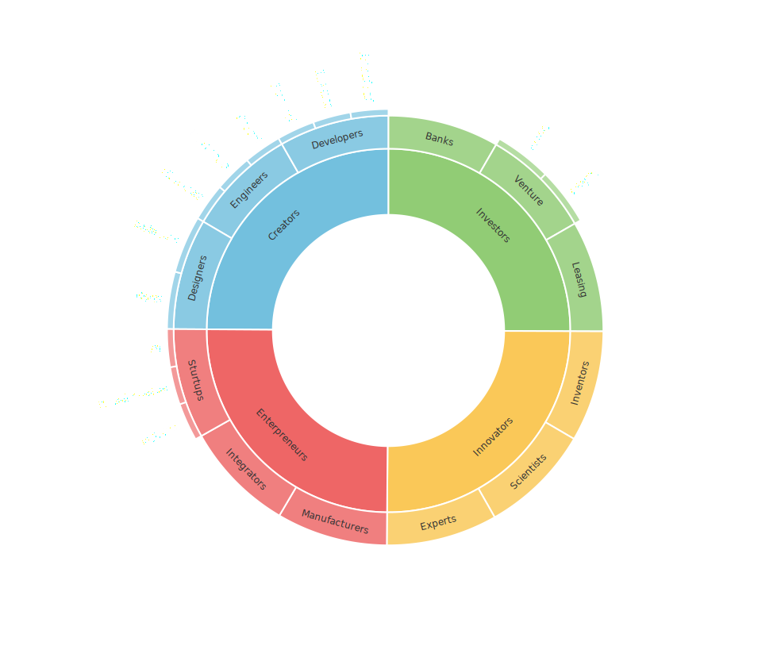

# Community

The Solenopsys community consists of:

- **Creators:** These individuals design and develop technical solutions, turning new ideas into reality. They include developers, engineers, and designers.
- **Innovators:** Innovators create new ideas, technologies, and approaches. They are the inventors, scientists, and experts whose knowledge and imagination help push beyond the boundaries of the known.
- **Investors:** Investors evaluate projects and provide financial resources to other community members.
- **Entrepreneurs:** Entrepreneurs use investors' funds to create businesses based on ideas and technologies from Creators and Innovators.

