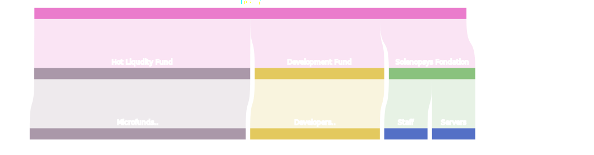

# SOL Token

The SOL token is an internal unit of account within our system, and its value is approximately equal to 1 dollar. This token plays a vital role in our ecosystem. It is used for conducting transactions among the participants of our network. It is also essential for the operation of smart contracts, making deals on our platform, and accessing high-performance cloud computing (HPC).

### Emission

The emission of SOL tokens occurs only when they are purchased on our trading platform SolExchange. It's important to note that the quantity of issued tokens is not limited. Emission of tokens is possible only if there are no other participants on the trading platform willing to sell tokens at a price lower than 1 USDC. In such a case, SOL tokens will be automatically issued at a price of 1 USDC per SOL.

### Token Purchase

For purchasing SOL tokens, Solechange is used. The payment method for buying is the USDC stablecoin. Users send the USDC amount to the Solenopsys Foundation wallet, and the trading platform automatically conducts transactions for purchasing SOL at the minimum rate among all platform participants.

### Token Burning

SOL tokens are only burned when executing the Hot Liquidity smart contract. This contract has strict usage restrictions and, upon execution, transfers USDC to an external wallet from the Solenopsys Foundation account.

### Hot Liquidity

The Hot Liquidity mechanism allows obtaining USDC tokens instead of SOL when executing a smart contract. This mechanism is designed to provide financial resources for community participants' projects and the rapid development of the Solenopsys infrastructure.

### Funds Distribution

Solenopsys Foundation is a nonprofit organization with the primary goal of developing the Solenopsys ecosystem. After receiving funds in the Foundation's account, a portion of these funds is directed to Hot Liquidity, while another part is allocated to the Development account, used to pay developers working on platform development. A smaller portion of the funds is used for the operation of Solenopsys Foundation, server expenses, and employee salaries.

Thus, a significant portion of the funds generated through emission is returned to the community in the form of liquidity. Solenopsys Foundation does not accumulate significant amounts of USDC on its accounts and immediately directs funds to infrastructure development. This approach minimizes the risk of capital loss due to hacking.
